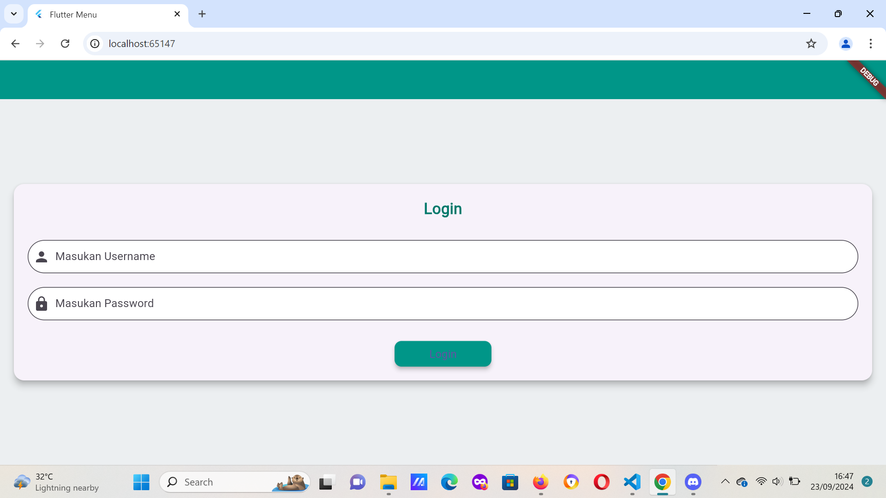
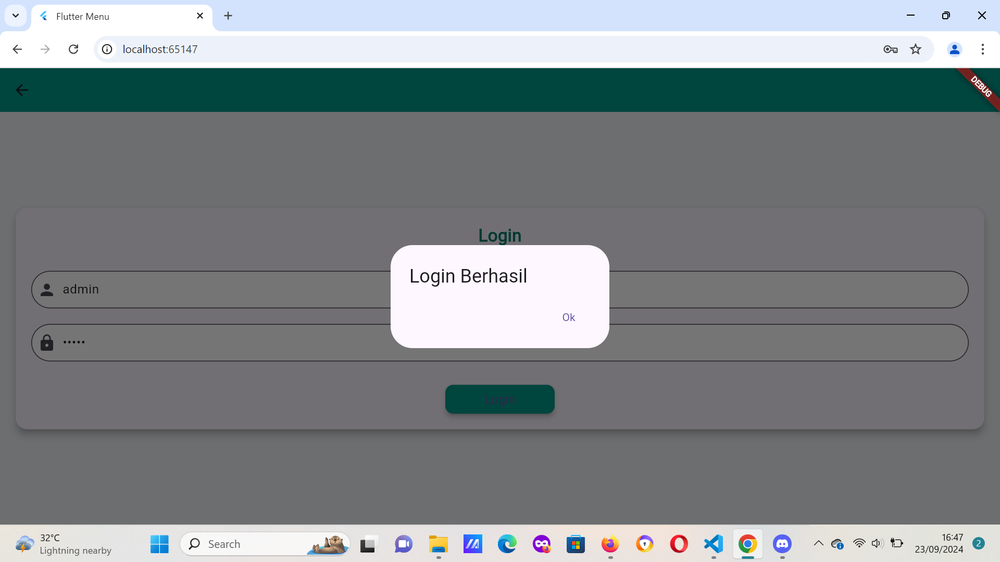
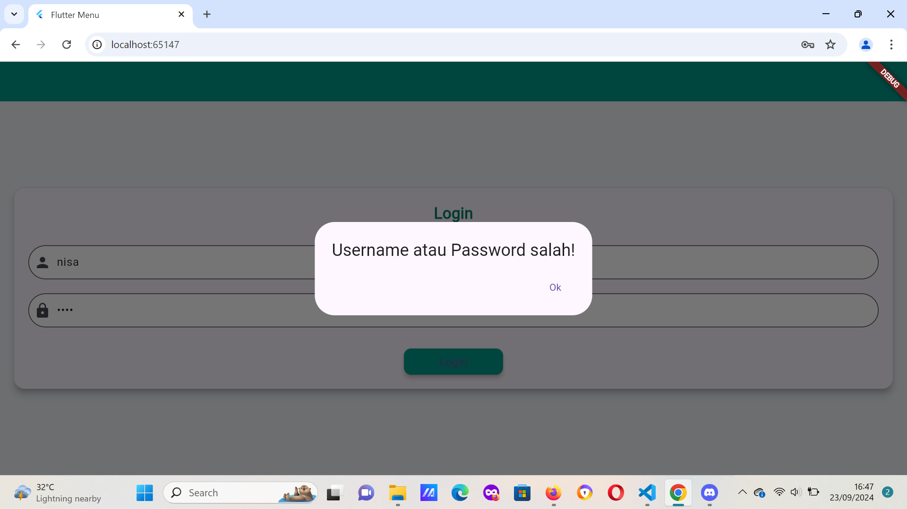
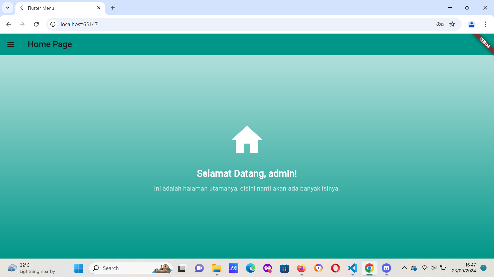
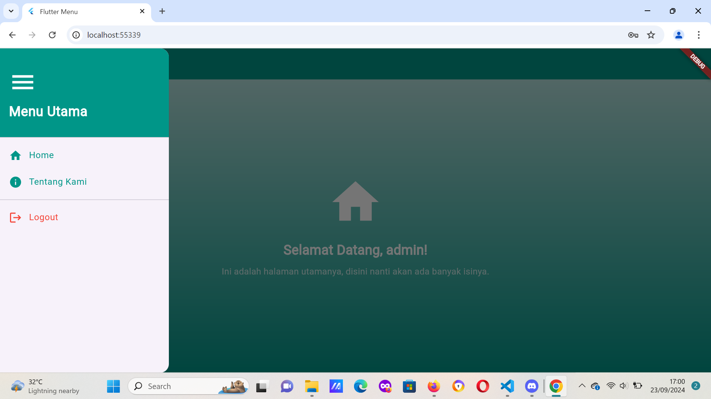

login page
Berikut adalah penjelasan bagian-bagian penting dari kode di atas:

1. Imports:
   - `import 'package:flutter/material.dart';`: Mengimpor pustaka `flutter/material.dart`, yang berisi widget dan gaya antarmuka yang disediakan oleh Flutter.
   - `import 'package:tugas_pertemuan3/homepage.dart';`: Mengimpor halaman `Homepage`, yang kemungkinan besar merupakan halaman utama yang akan ditampilkan setelah login berhasil.
   - `import 'package:shared_preferences/shared_preferences.dart';`: Digunakan untuk menyimpan dan mengambil data lokal secara persisten menggunakan `SharedPreferences`.

2. `Loginpage` Class (Stateful Widget):
   - `class Loginpage extends StatefulWidget`: Membuat `Loginpage` sebagai widget dengan keadaan (state) yang bisa berubah. Ini penting untuk halaman login, karena pengguna akan berinteraksi dengan aplikasi, seperti memasukkan data username dan password.
   - `State<Loginpage>`: Mengelola state dari `Loginpage`. Kelas ini berisi logika login dan antarmuka pengguna.

3. `TextEditingController`:
   - `final TextEditingController _usernameController = TextEditingController();`
   - `final TextEditingController _passwordController = TextEditingController();`
     Ini adalah pengontrol teks untuk mengambil data input dari pengguna (username dan password).

4. `_saveUsername` Function:
   - Fungsi ini menyimpan username yang dimasukkan oleh pengguna ke dalam `SharedPreferences`, yang memungkinkan aplikasi untuk menyimpan data secara lokal di perangkat. `SharedPreferences` sering digunakan untuk menyimpan data seperti preferensi atau data login sederhana.
   - `prefs.setString('username', _usernameController.text);`: Menyimpan username ke memori perangkat.

5. `_showInput` Function:
   - Digunakan untuk membuat widget `TextField` yang dinamis, yang menerima tiga parameter:
     - `controller`: Mengontrol input teks (username atau password).
     - `placeholder`: Placeholder teks untuk menunjukkan kepada pengguna apa yang harus dimasukkan (seperti "Masukan Username" atau "Masukan Password").
     - `isPassword`: Menentukan apakah teks yang dimasukkan adalah password (jika `true`, teks akan tersembunyi).
     - `icon`: Ikon yang ditampilkan di sebelah kiri input teks (misalnya ikon orang untuk username dan ikon kunci untuk password).

6. `_showDialog` Function:
   - Menampilkan dialog notifikasi untuk memberikan pesan umpan balik kepada pengguna (misalnya, jika login berhasil atau gagal).
   - `Navigator.push: Setelah menekan tombol "OK", pengguna akan diarahkan ke halaman berikutnya (`Homepage` jika login berhasil, atau `Loginpage` jika login gagal).

7. `build` Method:
   - Ini adalah bagian utama dari UI halaman login. Bagian ini mengembalikan `Scaffold`, yang berisi:
     - `AppBar`: Bar navigasi di bagian atas halaman, dengan warna dasar `teal`.
     - `Center`: Menempatkan konten di tengah layar.
     - `Card`: Menampilkan form login dalam sebuah kartu dengan border dan bayangan.
     - Form Login: Terdiri dari dua input (username dan password) dan satu tombol `ElevatedButton` untuk login.
     - `_showInput`: Memanggil fungsi untuk membuat field input username dan password.
     - `ElevatedButton`: Tombol untuk memicu proses login, di mana logika verifikasi username dan password terjadi.

8. Login Logic:
   - `if (_usernameController.text == 'admin' && _passwordController.text == 'admin')`: Logika sederhana yang memeriksa apakah username dan password adalah 'admin'. Jika benar, login berhasil, dan fungsi `_saveUsername` dipanggil untuk menyimpan username.
   - Jika login berhasil, dialog sukses muncul, dan pengguna diarahkan ke `Homepage`. Jika gagal, dialog gagal muncul, dan pengguna tetap berada di halaman login.

homepage
1. class Homepage extends StatefulWidget
   - StatefulWidget: Kelas Homepage merupakan subclass dari StatefulWidget, yang berarti halaman ini memiliki state yang dapat berubah (dinamis). Contoh perubahan state di halaman ini adalah memuat nama pengguna setelah login.
    - Constructor const Homepage({super.key}): Konstruktor default digunakan untuk membuat instance dari Homepage. Kata kunci const menunjukkan bahwa widget ini tidak memiliki nilai yang berubah dan bisa dioptimalkan.

2. _HomepageState createState() => _HomepageState();
Fungsi ini membuat dan mengembalikan state dari widget. Dalam kasus ini, state yang dibuat adalah _HomepageState, yang digunakan untuk mengelola perubahan pada widget Homepage.

3. class _HomepageState extends State<Homepage>
 Kelas _HomepageState adalah tempat seluruh logika yang berhubungan dengan tampilan dan state dari Homepage dikelola. Ini termasuk memuat nama pengguna (namauser) dan mengelola UI yang terkait.

4. var namauser;
    Variabel namauser digunakan untuk menyimpan nama pengguna yang diambil dari shared preferences. Nilai ini akan digunakan di dalam UI untuk menyapa pengguna.

5. Fungsi _loadUsername()
Fungsi ini bertanggung jawab untuk memuat username dari shared preferences (penyimpanan lokal).
    - SharedPreferences prefs = await SharedPreferences.getInstance();: Mengambil instance dari SharedPreferences untuk mengakses data yang disimpan di lokal.
    - setState(): Memanggil setState untuk memberitahu Flutter bahwa ada perubahan pada state (yaitu namauser), yang kemudian akan memicu UI untuk diperbarui dengan nama pengguna yang benar.
    - namauser = prefs.getString('username') ?? 'User';: Jika username ditemukan di shared preferences, nilainya digunakan; jika tidak, string default 'User' digunakan.

6. Fungsi build(BuildContext context)
    Fungsi build digunakan untuk membangun tampilan UI halaman Homepage. Fungsi ini dipanggil ulang setiap kali ada perubahan pada state.
    _loadUsername() dipanggil di dalam build, yang berarti setiap kali halaman dibangun, data username akan dimuat.

7. Scaffold
    Scaffold adalah widget dasar untuk membuat struktur aplikasi, yang terdiri dari berbagai komponen seperti AppBar, body, dan drawer.

8. AppBar
    -title: Bagian yang menampilkan judul pada bagian atas halaman, yaitu "Home Page".
    -backgroundColor: Colors.teal: Mengatur warna latar belakang pada AppBar menjadi warna teal.

9. Body (Isi Halaman)
    - Container: Digunakan untuk mengatur tata letak halaman. Di sini, Container menggunakan padding dan memiliki gradient sebagai latar belakang, yang memberikan efek warna gradien dari atas ke bawah.
    - Column: Widget Column digunakan untuk mengatur tata letak vertikal beberapa widget di dalam halaman, seperti ikon rumah, teks sapaan pengguna, dan deskripsi halaman.
    - Icon(Icons.home): Menampilkan ikon rumah besar di bagian atas halaman.
    Text('Selamat Datang, $namauser!'): Menampilkan teks sapaan yang memuat nilai namauser. Jika nama pengguna sudah dimuat dari shared preferences, maka akan menampilkan nama pengguna tersebut, misalnya "Selamat Datang, admin!".

10. Drawer
    - drawer: const Sidemenu(): Bagian ini mereferensikan widget Sidemenu sebagai drawer (menu samping). Drawer ini bisa digunakan untuk menavigasi ke halaman lain atau memunculkan opsi tambahan. Sidemenu dideklarasikan sebagai widget terpisah.
- State Management: Setiap kali setState dipanggil, UI akan diperbarui dengan nilai terbaru. Dalam hal ini, ketika namauser dimuat dari shared preferences, UI akan menampilkan sapaan dengan nama pengguna.
- Shared Preferences: Merupakan mekanisme penyimpanan sederhana untuk menyimpan data secara lokal, seperti username, yang bisa diambil kembali ketika aplikasi dibuka ulang.

About page
1. Imports:
    - import 'package:flutter/material.dart';: Mengimpor pustaka material.dart, yang merupakan bagian dari Flutter SDK untuk membangun UI berbasis Material Design.
    - import 'package:tugas_pertemuan3/sidemenu.dart';: Mengimpor file sidemenu.dart dari proyek, yang berisi widget Sidemenu, digunakan sebagai drawer (menu samping) di halaman ini.

2. Class AboutPage:
class AboutPage extends StatelessWidget: AboutPage adalah kelas yang merupakan halaman statis (tidak berubah) yang menggunakan StatelessWidget. Hal ini menunjukkan bahwa halaman ini tidak memerlukan perubahan state selama aplikasi berjalan.

3. Scaffold:
    - Scaffold adalah struktur dasar dari halaman Flutter yang menyediakan berbagai fitur seperti AppBar, Drawer, dan Body.
    - appBar: AppBar(...): Bagian ini mengatur tampilan AppBar di bagian atas halaman. Properti title diatur untuk menampilkan teks "Tentang Kami" dengan style tebal (bold), dan backgroundColor diatur menjadi warna Colors.teal.

4. Container dalam body:
Container adalah widget yang membungkus konten halaman dan digunakan untuk menambahkan padding serta dekorasi.
 
6. Drawer:
drawer: const Sidemenu(): Drawer (menu samping) adalah fitur navigasi yang diletakkan di sisi kiri halaman. Sidemenu adalah widget yang diimpor dari file sidemenu.dart.

side menu
   1. class Sidemenu extends StatelessWidget:
        -Kelas Sidemenu adalah turunan dari StatelessWidget, yang berarti widget ini tidak memiliki state yang berubah saat aplikasi berjalan.
        -StatelessWidget digunakan ketika UI tidak perlu di-update secara dinamis selama lifecycle widget.

    2. Widget build(BuildContext context):
        build method adalah fungsi utama yang digunakan untuk merender UI dari widget. Fungsi ini menghasilkan struktur visual dari widget, seperti menu dan item-item di dalamnya.
        BuildContext adalah konteks yang diberikan oleh Flutter untuk memberi informasi tentang lokasi widget dalam widget tree.

    3. Drawer:
        Drawer adalah widget yang digunakan untuk membuat menu samping (side navigation bar) di aplikasi Flutter. Menu ini biasanya muncul dari sisi kiri layar dan menampilkan berbagai item navigasi.

    4. ListView:
        ListView digunakan di dalam Drawer untuk menampilkan daftar item navigasi. ListView memungkinkan pengguna untuk menggulir jika item terlalu banyak untuk dimuat dalam satu layar.

    5. DrawerHeader:
        -DrawerHeader digunakan sebagai bagian atas dari menu samping (header). Dalam contoh ini, header memiliki latar belakang berwarna teal dan berisi ikon serta teks "Menu Utama".
        - BoxDecoration: Properti dekorasi untuk memberikan warna atau dekorasi lain pada DrawerHeader.

    6. Icon dan Text di dalam DrawerHeader:
        - Icon(Icons.menu): Menampilkan ikon dengan gambar menu dan ukuran 50. Ikon ini berwarna putih.
        - Text('Menu Utama'): Teks yang ditampilkan dalam header dengan gaya font berukuran besar, berwarna putih, dan bold.

    7. ListTile:
        - ListTile adalah widget yang digunakan untuk membuat item navigasi. Setiap ListTile memiliki ikon di bagian kiri (dalam properti leading) dan teks di bagian kanan (dalam properti title).
        - onTap: Fungsi yang dijalankan saat item menu ditekan oleh pengguna. Dalam hal ini, setiap item menavigasi ke halaman tertentu menggunakan Navigator.push.

##ScreenShot

